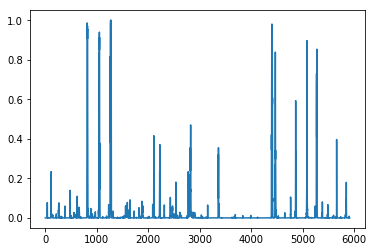
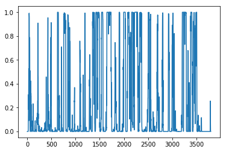
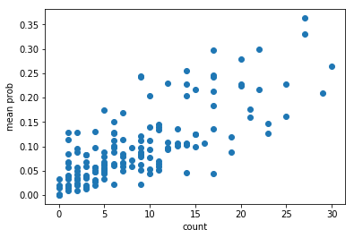
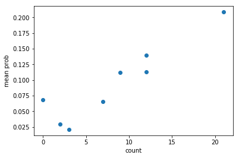
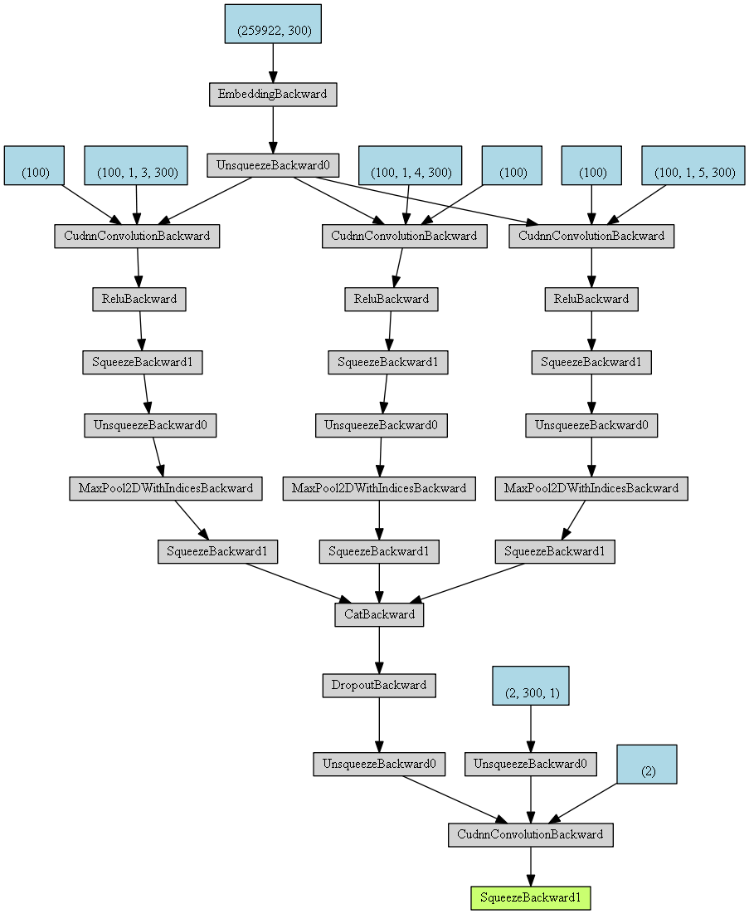

# Plagiarism detection using CNN

A toy experiment project for class paper. It contain crawler code, cleaning and CNN model code for 
plagiarism detection.

## Usage

See `batch_test.ipynb`

## Result

Images below are "risk" of plagiarism detected.

### Honest one

For `AI report_fan_yang_117106010714.docx`

### Cheat one

For `AI report_Luojia_Zhang_117106021976.docx`

### Mean risk scatter

Train set:

Test set:

## Sturcture(PyTorchViz)

## Reference

Kim, Yoon. "Convolutional neural networks for sentence classification." arXiv preprint arXiv:1408.5882 (2014).

Shen Li, Zhe Zhao, Renfen Hu, Wensi Li, Tao Liu, Xiaoyong Du, Analogical Reasoning on Chinese Morphological and Semantic Relations, ACL 2018.

https://github.com/Embedding/Chinese-Word-Vectors
